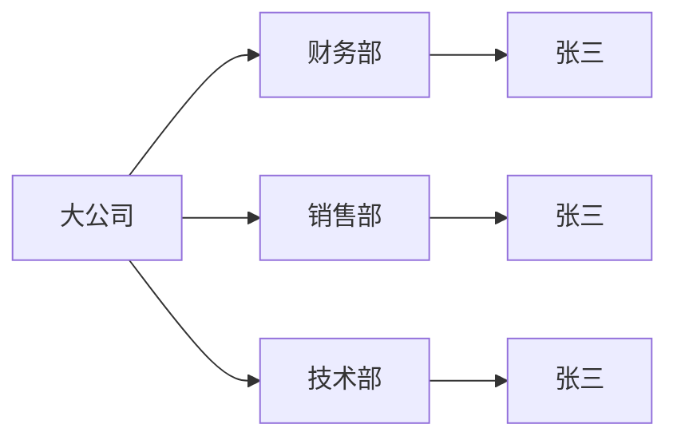
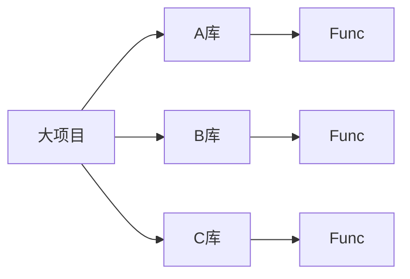

# 一、C++ 语言基础

入门必备知识  
基础 · 规范 · 实用

---
layout: two-cols
layoutClass: gap-4
---

## 初级模板

```cpp {all|1|1|2|2|2|2|4|8|all}
#include <bits/stdc++.h>
using namespace std;

int main() {
    
    // do something...
    
    return 0;
}
```

::right::

<v>

如果你不想深究背后的原理，初学时可以直接将这个「框架」背下来

</v>

<v>

### 头文件

- 代码复用
- 接口调用

### 预处理器

直接将头文件内容复制到当前文件

> 通过下面的命令可以查看预处理器究竟是如何工作的
>
> ```cpp
> g++ -E main.cpp -o main.i
> ```

</v>
<v>

### 万能头
`#include <bits/stdc++.h>` 包含了大多数常用头文件

- ✓ 算法竞赛常用，简便快速
- ✗ 工程开发不推荐（增加编译时间、项目依赖不清晰）

### 示意内容

```cpp
// <bits/stdc++.h> 实际上包含了以下常用头文件
#include <iostream>      // 输入输出
#include <vector>        // 动态数组
#include <algorithm>     // 排序、查找等算法
#include <string>        // 字符串
#include <map>           // 映射
#include <set>           // 集合
#include <queue>         // 队列
#include <stack>         // 栈
#include <cmath>         // 数学函数
#include <cstring>       // 字符串处理
// ...
```


</v>

<v class="w-5/7">




- 方便区分
- 避免污染

</v>
<v>

### `using namespace`

指定默认命名空间

`using namespace std;`

默认使用 `std` 空间内的内容  
之后就不用显式声明 `std::`

- ✓ 算法竞赛常用
- ✗ 工程开发不推荐
</v>
<v>

### `using` 关键字

也可以只引入特定名称：

```cpp
using std::cout;
using std::endl;

cout << "Hello" << endl;
```

</v>
<v>

### 其他用法

也可以使用 `using` 声明类型别名：

```cpp
using int_array = int[10];      // 数组类型别名
using func_ptr = void(*)(int);  // 函数指针类型别名
using myint = int;              // 简化类型名
```

对比 `typedef`（传统方式） 更简洁、优雅、易读：

```cpp
typedef int myint;
typedef int int_array[10];
```

</v>

<v>

### `main` 函数

程序的入口点，执行从这里开始

```cpp
int main() {
    // 你的代码
    return 0;
}
```

- `int` 表示函数返回整数类型
- `main` 是固定的函数名
- 每个 C/C++ 程序有且仅有一个 `main` 函数

> `main` 由运行时启动代码调用，在大多数操作系统中，其在 `_start` 函数中被调用
</v>

<v>

### `return 0`

表示程序正常结束

- `0` 表示成功执行
- 非 `0` 值通常表示错误

操作系统会接收这个返回值：
```cpp
return 0;   // 成功
return 1;   // 出错
return -1;  // 出错
```

> 在算法竞赛中，通常都返回 `0`
</v>

---
layout: two-cols
layoutClass: gap-4
---

## 注释

```cpp {all}
// 单行注释
// 双斜杠后的内容都会被注释

/*
多行注释
可以一次注释多行代码
*/

int main() {
    // 注释可以用来解释代码
    // 也可以让某段代码不执行但保留在源文件里
    
    // cout << "这行代码不会执行";
    cout << "这行代码会执行";
    
    return 0;
}
```

::right::

<v>

### 作用

- 解释程序的意思
- 临时禁用代码
- 对程序运行没有影响

### 注意事项

⚠️ `\` 与 `/` 是两种不同的斜杠

- `/` 用于注释
- `\` 用于转义字符

</v>

---
layout: two-cols
layoutClass: gap-4
---

## 浮点数比较

```cpp {all|9-}
double a = 0.1, b = 0.2, c = 0.3;

// ❌ 错误：直接比较浮点数
cout << "a + b = " << (a + b) << '\n';// 0.30000000000000004
cout << "c = " << c << '\n';          // 0.3
cout << 
    (a + b == c ? "相等" : "不相等");  // 不相等！

// ✓ 正确：使用 epsilon 进行比较
const double eps = 1e-9;
if (abs(a + b - c) < eps) {          // 认为相等
    cout << "认为相等\n";
} else {
    cout << "不相等\n";
}
```

::right::

<v>

### 为什么会有误差？

浮点数采用 **IEEE 754 标准**，用二进制表示，无法精确表示所有十进制小数。

**根本原因**：某些十进制小数在二进制中是**无限循环**的

例如 0.1 的二进制表示：
$$0.1_{(10)} = 0.00011001100110011\ldots_{(2)}$$

**实际计算过程**：
- `0.1` 存储为近似值 `0.1000...0001`
- `0.2` 存储为近似值 `0.2000...0003`
- 相加后的结果略大于 `0.3`

效率高

</v>

<v>

### 如何正确比较？

使用 **epsilon（$ϵ$）比较法**：

$$|a - b| < \varepsilon \Rightarrow a \approx b$$

```cpp
const double eps = 1e-9;
if (abs(a - b) < eps) {
    // 认为 a 和 b 相等
}
```

**epsilon 的选择**：
- `1e-6` ~ `1e-9`：适用于大多数场景
- `1e-12`：高精度场景

</v>

---
layout: two-cols
layoutClass: gap-4
---

## 隐式转换

```cpp
if (1) {
    cout << "1 is true" << '\n';       // 1 is true
}

if (0) {
    cout << "0 is true" << '\n';
} else {
    cout << "0 is false" << '\n';      // 0 is false
}

if (-1) {
    cout << "-1 is also true" << '\n'; //-1 is also true
}

// 字符类型的运算
char ca = 'a';
auto x = ca + 10; // x: int
cout << x;  // 输出：107（'a' 的 ASCII 码是 97）
```

::right::

<v>

### 条件语句中的转换    
- 在条件语句中，数值转换为布尔值
  - `0` → `false`
  - 非 `0`（包括负数）→ `true`

<br/>

### 算术运算中的转换
- 当不同类型混合运算时，会自动转换为更"宽泛"的类型
- `char` + `int` → `int`
- `int` + `long` → `long`
- `int` + `double` → `double`

</v>
---
layout: two-cols
layoutClass: gap-4
---

## 输入输出优化

```cpp {1|2}
ios::sync_with_stdio(false);
cin.tie(nullptr);
```

::right::

<v>

### 流同步

C++ 的 `cin`/`cout` 和 C 的 `scanf`/`printf` 默认同步

- 关闭同步可以大幅提升 `cin`/`cout` 效率
- ⚠️ 关闭后不能混用 `cin`/`cout` 和 `scanf`/`printf`

</v>

<v>

### `cin.tie(nullptr)`

默认情况下，每次 `cin` 前会自动刷新 `cout` 缓冲区

- 解绑后，`cin` 和 `cout` 互不干扰
- 效率更高

</v>
---
layout: two-cols
layoutClass: gap-4
---

## `\n` 和 `endl` 的区别

```cpp {all|1-2|4-}
cout << 1 << endl;
cin >> a;

// 解除绑定，这样输入的时候就不会自动刷新缓冲区
cin.tie(nullptr); 
cout << 1 << '\n';
cin >> a;
```

::right::

<v>

**`endl`**：立即刷新缓冲区
- 程序立刻把数据写到屏幕上
- 效率较低
- 避免频繁使用

**`'\n'`**：仅换行，不刷新
- 数据先存在缓冲区
- 效率较高

<br/>

- 程序结束的时候会自动刷新缓冲区
- 如果没有解绑 `cin.tie` 那么 `cin` 的时候也会自动刷新缓冲区

</v>

<v>

输入 `c`
回显：
```
1c
```

</v>

<v>

输入 `c`
回显：
```
c1
```

</v>


---
layout: two-cols
layoutClass: gap-4
---

## EOF (End of File)

```cpp {all|2|all}
int a;
while (cin >> a)  // cin 返回值判断
    cout << a << '\n';
```

::right::

<v>

### 什么是 EOF

End of File 的缩写，表示文件结束标志

**输入 EOF**：
- Windows: `Ctrl + Z`
- Linux/Mac: `Ctrl + D`

</v>

<v>

### cin 的返回值

`cin >> a` 会返回 cin 本身：

- 成功读取 → `true`
- 读取到 EOF → `false`

</v>

<v>

### 使用场景

有些题目不告诉读取多少数据，需要自行判断：

</v>

---
layout: two-cols
layoutClass: gap-4
---

## ACM 常用模板

```cpp {all|4|5|7-9|11-|all}
#include <bits/stdc++.h>
using namespace std;

using ll = long long;
// #define int long long // 邪修

void solve() {
    // 在这里写核心处理流程
}

signed main() {
    ios::sync_with_stdio(false);
    cin.tie(nullptr);
    
    int T = 1;
    // cin >> T;  // 多测时取消注释
    while (T--) {
        solve();
    }
    
    return 0;
}
```

::right::

<v></v>

<v>

### 类型别名

```cpp
using ll = long long;
```

简化码量，`ll` 等同于 `long long`

</v>

<v>

### 防止溢出

一键将 `int` 替换为 `long long`
- `int` 范围：$-2^{31}$ ~ $2^{31}-1$ (约 $2 \times 10^9$)
- `long long` 范围：$-2^{63}$ ~ $2^{63}-1$

⚠️ 使用时 main 要写成 `signed main()`

> 最好是在写题之前就预估好需要的范围，不要之后才恍然大悟要改范围

</v>
